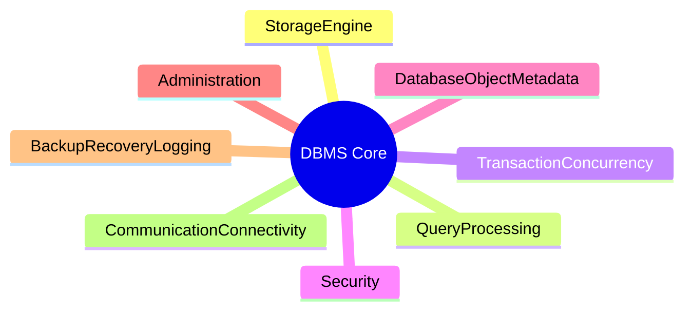
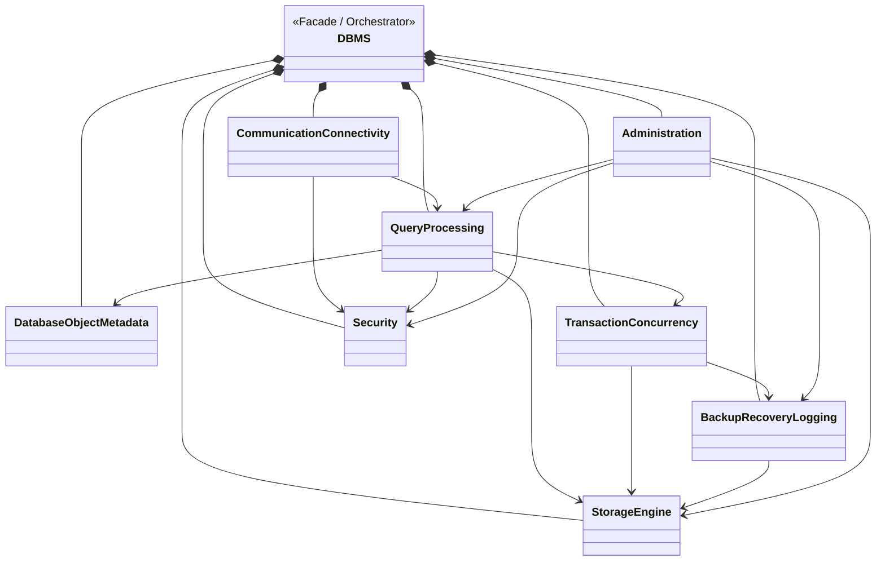

# DBMS — Database Management System

A modular, SOLID-compliant Database Management System designed with a top-down architecture approach.
The system is decomposed into 8 core subsystems, each designed with clear interfaces, entities, and service classes following OOP best practices.

---

## Architecture Overview

### Layer 1 — System Domains

### Dependency Definitions

Dưới đây là bảng giải thích chi tiết các mối quan hệ (Dependencies) được thiết lập trong kiến trúc Layer 1:

| Nguồn gọi (Source) | Phụ thuộc vào (Target) | Mục đích / Hành động |
|---|---|---|
| **CommunicationConnectivity** | QueryProcessing | Gửi câu lệnh SQL để xử lý |
| **CommunicationConnectivity** | Security | Yêu cầu kiểm tra Authentication thông tin kết nối |
| **QueryProcessing** | DatabaseObjectMetadata | Nhận metadata (Schema/Catalog) để validate |
| **QueryProcessing** | StorageEngine | Gửi yêu cầu Đọc/Ghi dữ liệu vật lý |
| **QueryProcessing** | TransactionConcurrency | Tạo context giao dịch, yêu cầu Lock |
| **QueryProcessing** | Security | Kiểm tra Authorization (quyền) của câu truy vấn |
| **TransactionConcurrency** | StorageEngine | Lock các bản ghi/Page vật lý |
| **TransactionConcurrency** | BackupRecoveryLogging | Đẩy log vào WAL (Write-Ahead Log) trước khi commit |
| **BackupRecoveryLogging** | StorageEngine | Flush dữ liệu khi Checkpoint hoặc Restore Page |
| **Administration** | Security | Truy xuất vào Audit Log, phân mảnh quyền user |
| **Administration** | BackupRecoveryLogging | Kích hoạt kịch bản tạo Backup |
| **Administration** | QueryProcessing | Thu thập Metrics, Slow queries |
| **Administration** | StorageEngine | Kích hoạt bảo trì (Vacuum), chạy kiểm tra DBCC |

---

## Design Principles

| Principle | Application |
|---|---|
| **SOLID** | Each class has a single responsibility; interfaces are segregated by functionality |
| **ISP** | Fat interfaces split into focused interfaces (e.g., `IFileReader`, `IFileWriter`, `IFileSynchronizer`) |
| **DIP** | High-level modules depend on abstractions, not concrete implementations |
| **Design Patterns** | Facade, Template Method, Strategy, Composite, Iterator used per module |
